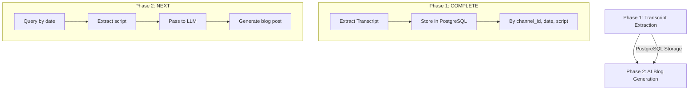

# CLAUDE.md

This file provides guidance to Claude Code (claude.ai/code) when working with code in this repository.

## Overview

The **Chinese Financial Education Blog Pipeline** is a streamlined 2-phase system that transforms Traditional Chinese financial education videos into SEO-optimized blog posts. The system processes content from 于庭皓's YouTube channel through transcript extraction and AI-powered blog generation.

## High-Level Architecture

### Simplified 2-Phase Workflow



## Technology Stack

- **Language**: Python 3.8+
- **Database**: PostgreSQL in Zeabur cloud
- **Transcript API**: YouTubeTranscriptApi 1.2.2
- **AI**: OpenAI GPT-4, Anthropic Claude
- **Target**: Ghost CMS integration

## Phase Architecture

### ✅ Phase 1: Transcript Extraction - COMPLETE
**Location**: `/financial-blog-pipeline/extraction/`

**Status**: ✅ **Fully Operational**

**Purpose**: Extract Traditional Chinese transcripts and store in PostgreSQL
- **✅ Working**: Transcript extraction from 于庭皓 channel
- **✅ Tested**: Video `p08_Rkh36bA` - 33.5min, 11,770 chars extracted
- **✅ Stored**: Complete with video_id, title, channel_name, publish_date, transcript_text

**Key Features**:
- Channel ID-based extraction: `UC0lbAQVpenvfA2QqzsRtL_g`
- Zeabur PostgreSQL storage
- Traditional Chinese support
- Daily automation ready

### 🎯 Phase 2: Content Creation - NEXT
**Location**: `/financial-blog-pipeline/generation_content/` *(to be created)*

**Purpose**: Load latest transcript from PostgreSQL and generate blog posts
- **Input**: Latest transcript from `video_transcripts` table
- **Output**: Structured blog post for Ghost CMS
- **LLM Integration**: Claude/OpenAI API for Traditional Chinese content

**Blog Structure**:
1. **Hook**: Compelling opening with market context
2. **Market Impact**: How this affects Taiwan/US markets
3. **Beginner Explanation**: Simplified financial concepts
4. **Key Takeaways**: Actionable insights for investors

## Database Schema

```sql
video_transcripts (
    video_id VARCHAR(20) PRIMARY KEY,
    title TEXT NOT NULL,
    channel_name VARCHAR(200),
    publish_date TIMESTAMP,
    transcript_text TEXT,
    duration_seconds INTEGER,
    created_at TIMESTAMP DEFAULT NOW()
)
```

## Quick Start Commands

### ✅ Phase 1 - Active Commands
```bash
cd financial-blog-pipeline/extraction

# Extract latest video from 于庭皓
python get_latest_by_channel.py -chanId UC0lbAQVpenvfA2QqzsRtL_g 1 1

# List stored videos
python get_latest_by_channel.py --list "于庭皓"

# Test database connection
python -c "from database_setup import test_connection; test_connection()"
```

### 🎯 Phase 2 - Development Commands *(Next)*
```bash
cd financial-blog-pipeline/eneration_content

# Generate blog from latest transcript
python generate_blog.py --latest

# Generate blog for specific date
python generate_blog.py --date 2025-08-06

# Preview blog without publishing
python generate_blog.py --preview
```

## Environment Setup

### Required Variables
Create `.env` file:
```bash
# Zeabur PostgreSQL
POSTGRES_HOST=hkg1.clusters.zeabur.com
POSTGRES_PORT=31546
POSTGRES_DATABASE=financial_blog
POSTGRES_PASSWORD=your_password
POSTGRES_USER=root

# LLM APIs
OPENAI_API_KEY=your_openai_key
ANTHROPIC_API_KEY=your_claude_key
```

## Next Steps - Phase 2 Development

### 🎯 Immediate Tasks
1. **Create Phase 2 directory**: `/financial-blog-pipeline/phase2_generation/`
2. **Build query engine**: Load transcripts by date/channel
3. **Integrate LLM**: Claude/OpenAI for Traditional Chinese
4. **Format for Ghost**: Create Ghost CMS compatible output
5. **Test with real data**: Use extracted `p08_Rkh36bA` transcript

### 📊 Daily Workflow (Ready to Implement)
```bash
# 1. Extract latest transcript
python extraction/main.py

# 2. Generate blog post
python phase2_generation/generate_blog.py --latest

# 3. Preview content
python phase2_generation/generate_blog.py --preview
```

## Key Commands Summary

| Phase | Command | Status | Purpose |
|-------|---------|--------|---------|
| **Extract** | `python get_latest_by_channel.py -chanId UC0lbAQVpenvfA2QqzsRtL_g 1 1` | ✅ Ready | Get latest transcript |
| **Create** | `python generate_blog.py --latest` | 🎯 Next | Generate blog from transcript |
| **Preview** | `python generate_blog.py --preview` | 🎯 Next | Test blog content |

## Ready for Phase 2

**Phase 1 is complete and tested.** The system has successfully extracted and stored Traditional Chinese transcripts from 于庭皓's channel. **Phase 2 content creation is ready to begin** - the next step is to load these transcripts from PostgreSQL and generate blog posts using LLM processing.

**Current Status**: 11,770 characters of Traditional Chinese financial content ready for LLM processing.