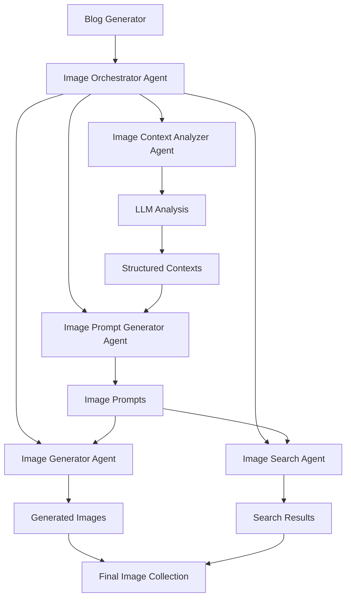

# Agent-Based Image Generation Architecture

This document explains the agent-based approach for image generation in the blog pipeline.

## Architecture Overview

## Agent Responsibilities

### 1. Image Context Analyzer Agent
- **Purpose**: Analyze blog content to identify relevant image contexts
- **Input**: Blog content and title
- **Output**: Structured contexts with keywords and image types
- **Technology**: Anthropic Claude API
- **Key Features**:
  - Extracts financial terms, company names, and market indicators
  - Determines appropriate image types (charts vs. photos)
  - Suggests positioning within the blog post

### 2. Image Prompt Generator Agent
- **Purpose**: Generate appropriate prompts for image creation/search
- **Input**: Contexts from analyzer
- **Output**: Specific prompts for each context
- **Key Features**:
  - Creates detailed prompts for chart generation
  - Generates search terms for photo lookup
  - Optimizes prompts for different image types

### 3. Image Generator Agent
- **Purpose**: Generate new images using DALL-E
- **Input**: Generation prompts
- **Output**: Generated image URLs
- **Technology**: OpenAI DALL-E 3
- **Use Cases**:
  - Financial charts and graphs
  - Market trend visualizations
  - Data-driven illustrations

### 4. Image Search Agent
- **Purpose**: Find existing images from Unsplash
- **Input**: Search prompts
- **Output**: Image URLs from Unsplash
- **Technology**: Unsplash API
- **Use Cases**:
  - Stock photography
  - Illustrative images
  - Conceptual visuals

### 5. Image Orchestrator Agent
- **Purpose**: Coordinate all image generation activities
- **Input**: Blog content and title
- **Output**: Collection of relevant images
- **Key Features**:
  - Manages workflow between all agents
  - Handles error cases and fallbacks
  - Combines results from different sources
  - Ensures optimal image selection

## Workflow

1. **Content Analysis**: Orchestrator calls Context Analyzer to understand blog content
2. **Context Extraction**: Analyzer uses LLM to identify relevant image contexts
3. **Prompt Generation**: Orchestrator calls Prompt Generator with contexts
4. **Parallel Processing**: Orchestrator calls Generator and Search agents simultaneously
5. **Result Collection**: Orchestrator collects images from both sources
6. **Final Selection**: Orchestrator combines and returns final image collection

## Benefits

- **Specialization**: Each agent focuses on a specific task
- **Scalability**: Easy to add new agents or modify existing ones
- **Maintainability**: Clear separation of concerns
- **Flexibility**: Can easily switch between different image sources
- **Robustness**: Built-in fallback mechanisms
- **Performance**: Parallel processing of image generation and search

## Error Handling

- Each agent handles its own errors gracefully
- Orchestrator provides fallback mechanisms
- System continues to work even if some agents fail
- Clear error messages for debugging